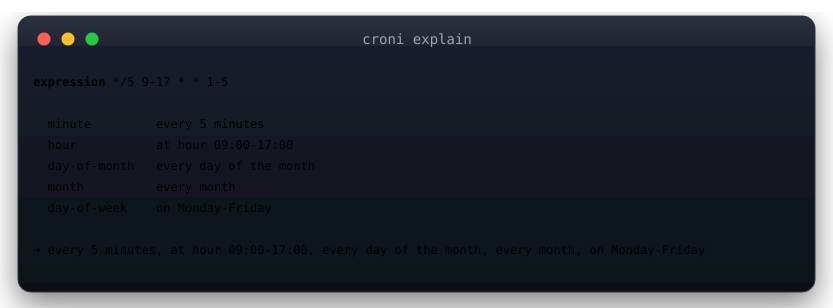
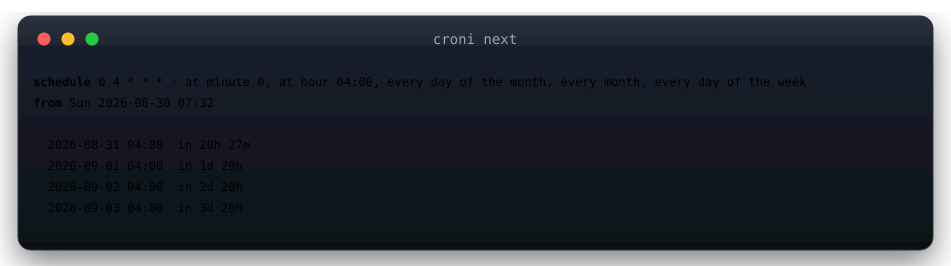

<div align="center">


# croni

**cron expressions, explained.**

[](https://github.com/v01dst/croni/actions/workflows/ci.yml)
[](LICENSE)


</div>

## ✨ Why croni?

Nobody remembers what `*/5 9-17 * * 1-5` does — and nobody should risk guessing in prod. croni turns cryptic cron syntax into plain English, predicts the next runs with **correct calendar math** (month lengths, leap years, the POSIX dom/dow OR rule), and lints your crontabs — in a single zero-dependency binary.

- 🗣️ **Plain-English explanations** — one line per field, plus a full summary sentence
- ⏭️ **`next` runs with humanized deltas** — "in 3h 12m"
- ✅ **Crontab validation** — per-line ✅/❌ with the exact parse error
- 🧮 **POSIX-correct** — `0 0 13 * 5` really does match every 13th *and* every Friday
- 🤖 **`--json` everywhere** — pipe it into your scripts
- 📦 **Zero dependencies** — one static binary, stdlib only

## 🖼️ Showcase

```bash
croni explain "*/5 9-17 * * 1-5"
```



```bash
croni next "0 4 * * *" -n 4
```



## 📦 Install

```bash
# with Go
go install github.com/v01dst/croni@latest

# from source
git clone https://github.com/v01dst/croni && cd croni && go build -o croni .

# or grab a prebuilt binary from Releases
```

## 🚀 Usage

```bash
croni explain "*/5 9-17 * * 1-5"      # plain-English breakdown
croni explain "@weekly"               # specials too
croni next "0 4 * * *" -n 3           # next 3 runs, humanized deltas
croni next "*/15 * * * *" --from 2026-09-01T00:00:00Z
croni validate /etc/crontab           # lint every line
croni "0 12 * * 1"                    # bare expression → explain
```

Exit codes: `0` ok · `1` usage error · `2` invalid expression — script-friendly.

## 🧠 Grammar

| Syntax          | Example        | Meaning                    |
| --------------- | -------------- | -------------------------- |
| `*`             | `* * * * *`    | every value in range       |
| step            | `*/5`, `1-30/2`| every Nth value            |
| range           | `9-17`         | inclusive range            |
| list            | `1,15,30`      | explicit set               |
| names           | `JAN-MAR`, `MON-FRI` | month/day names      |
| special         | `@hourly @daily @noon @weekly @monthly @yearly @reboot` | presets |
| `7` in dow      | `* * * * 7`    | normalized to Sunday (0)   |

POSIX semantics honored: when **both** day-of-month and day-of-week are restricted, a time matching **either** fires.

## 🛠️ Development

```bash
go build -o croni .
go test ./...
go vet ./... && gofmt -l .
```

## 🗺️ Roadmap

- [ ] 6-field (seconds) support
- [ ] `prev` — previous N runs
- [ ] `cal` — month-view rendering of upcoming runs
- [ ] TZ-aware `--from` with zone names

## 🤝 Contributing

PRs welcome — `go test ./...` must pass and stdlib-only stays non-negotiable.

## 📄 License

[MIT](LICENSE) © 2026 v01dst
